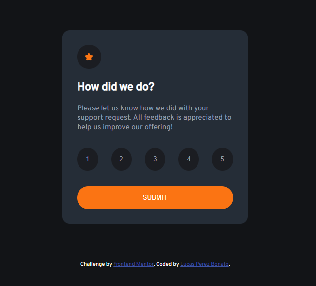
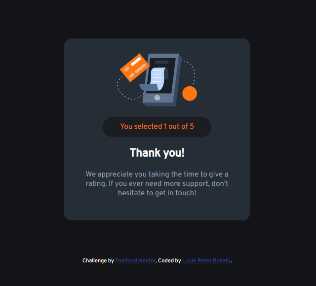
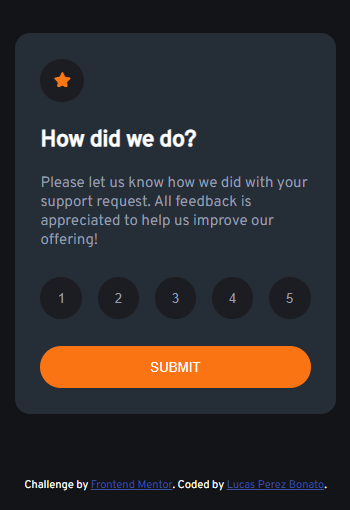
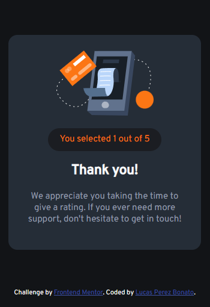

## Table of contents

- [The challenge](#the-challenge)
- [Screenshot](#screenshot)
- [My process](#my-process)
- [Built with](#built-with)
- [Acknowledgments](#acknowledgments)

### The challenge

Users should be able to:

- View the optimal layout for the app depending on their device's screen size
- See hover states for all interactive elements on the page
- Select and submit a number rating
- See the "Thank you" card state after submitting a rating

### Screenshot

## My process
    In the first place I see the desings and start building the HTML, dividing it to each section, after I start the CSS with the Mobile-first, creating some os the variables to help me out anddividing fixing some things in the HTML and making the Media-query for PC version right after, the Script it was the easy part to be honest, and always using the git/github desktop to divide the branchs as well.

### Built with

- Semantic HTML5 markup
- CSS custom properties
- Flexbox
- Mobile-first workflow

## Acknowledgments

My tip is, don't let your mind control you, search, ask for help from others you know, programming and web development isn't always easy, and with friends is better.
